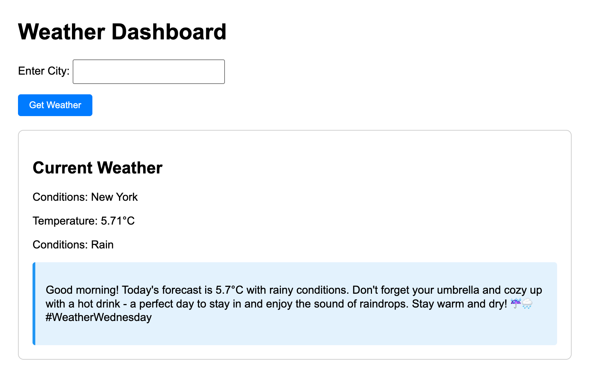

# Weather Dashboard with AI Commentary

A modern weather dashboard application that combines real-time weather data with AI-generated insights. Built with Go and Temporal workflow engine, this project demonstrates a production-ready microservices architecture.

## Key Features
- Real-time weather data fetching using OpenWeatherMap API
- AI-powered weather commentary using OpenAI's GPT-3.5
- Durable workflow execution with Temporal
- Clean, responsive web interface
- Fault-tolerant design with graceful degradation

## Screenshot


## Getting Started

### Prerequisites
- Go 1.x
- Temporal server running locally or accessible endpoint
- OpenWeatherMap API key
- OpenAI API key

### Configuration
Create a `config/config.yaml` file with your API keys:

```yaml
weather:
  api_key: "your-openweathermap-api-key"

openai:
  api_key: "your-openai-api-key"

temporal:
  host_port: "your-temporal-server-host:port"
```

## Project Structure 

```
├── config/
│   └── config.yaml              # Configuration file
├── weather/
│   ├── activity.go              # Weather API integration
│   ├── ai_agent.go              # OpenAI integration
│   └── workflow.go              # Temporal workflow definition
├── worker/
│   └── main.go                  # Temporal worker implementation
├── main.go                      # Web server and main
└── README.md                    # Project documentation
```

## Installation

1. Clone the repository:
```bash
git clone https://github.com/popand/weather-dashboard
cd weather-dashboard
```

2. Install dependencies:
```bash
go mod tidy
```

## Running the Application

1. Start the Temporal worker:
```bash
cd worker && go run main.go
```

2. In a separate terminal, start the web server:
```bash
go run main.go
```

3. Access the dashboard at `http://localhost:8088`

## Web Interface Features

The dashboard provides:
- Simple city input form
- Weather display card showing:
  - City name
  - Current temperature (°C)
  - Weather conditions
  - AI-generated weather commentary

## Error Handling

The application includes comprehensive error handling:
- API call failures
- Invalid city names
- Workflow execution errors
- Configuration errors

## Technical Stack
- Backend: Go
- Workflow Engine: Temporal
- APIs: OpenWeatherMap, OpenAI
- Frontend: HTML/CSS
- Configuration: Viper
